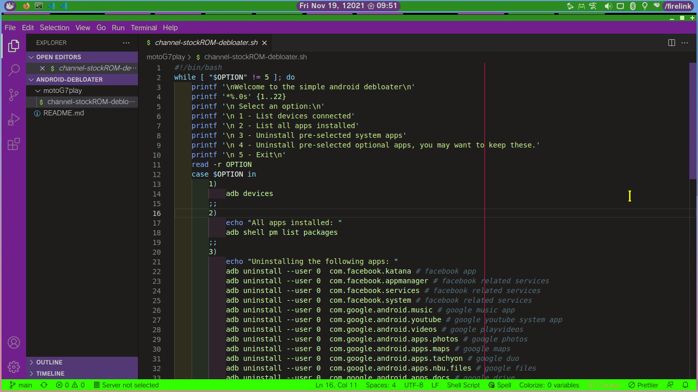

# Evangelion Unit 01 theme for VS Code
This theme was made to match gtk3/XFCE [Eva-01](https://github.com/inatagan/eva-01) theme

<!--  -->

---
## Installation
Launch VS Code Quick Open (Ctrl+P), paste the following command, and press enter.

`ext install inatagan.eva-01-vscode-theme`

---
## Color pallette
Eva green|Eva purple 1|Eva purple 2|Eva dark grey
:---:|:---:|:---:|:---:
|||
#33ff00|#711F8C|#523874|#1F1D1C

## Preview
### full-screen

**Enjoy!**
